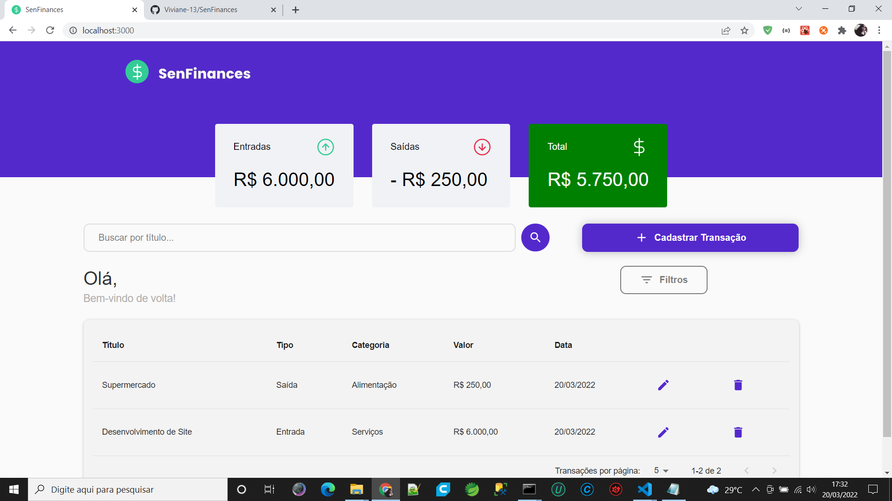

# Senfinances

# Página Home da Aplicação
<p>O senfinances é uma aplicação de controle financeiro pessoal. O usuário pode cadastrar transações de entrada e saída e acompanhar suas finanças de modo geral</p>
<h1 align="center">
    
</h1>

<br>

## 🧪 Technologies

This project was developed using the following technologies:

- [React](https://reactjs.org)
- [Firebase](https://firebase.google.com/)
- [TypeScript](https://www.typescriptlang.org/)

## 🚀 Getting started

Clone the project and access the folder.

```bash
$ git clone https://github.com/Viviane-13/SenFinances
$ cd SenFinances
```

Follow the steps below:
```bash
# Install the dependencies
$ yarn install

# Start the project
$ yarn start
```
The app will be available for access on your browser at http://localhost:3000


<p align="center">Made with 💜 by Viviane Oliveira</p>
